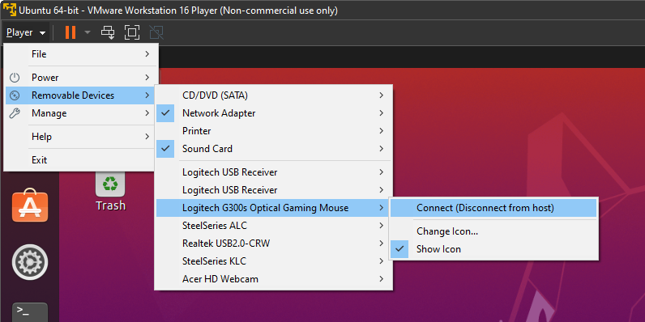

# Linux USB Mouse Sound Driver
This is a Linux device driver for USB Mouse which plays virtual click sounds when a mouse button is clicked.

If you come across this repository, you probably want to develop a mouse device driver on Linux as a course project.
I also did this as a course project (Operating Systems, if you are wondering). I had to dive deep into the internet
when I was trying to achieve something for this project and I want to share all the knowledge I have.

Most of the code for this project is from the official Linux USB mouse device driver implementation, which can be
found [here](https://github.com/torvalds/linux/blob/master/drivers/hid/usbhid/usbmouse.c).

# Usage
First of all, I highly recommend using a virtual machine when inserting a kernel driver since it can harm your device.
I will explain how to use this device driver (or any other mouse device drivers) for **Ubuntu 20.04** on **VMware**;
however, you can still follow this guide even if you don't have the same environment.

## Plug Your Mouse
If you are using a virtual machine, just like me, you probably need a spare mouse and keyboard since we are going to
hot-plug the mouse and if you don't have a spare mouse, you can lose control of your host device (VMware doesn't even
allow you to hot-plug your mouse if you don't have a spare one).



## Install Module
Clone this repository and install kernel modules with the following commands:

```console
biarmic@ubuntu:~$ git clone https://github.com/biarmic/linux-mouse-sound-driver.git
biarmic@ubuntu:~$ cd linux-mouse-sound-driver
biarmic@ubuntu:~$ make
biarmic@ubuntu:~$ sudo insmod driver.ko
```

## Bind Your Mouse
After you insert the module, nothing will happen because the mouse is not binded to the new device driver. In order
to do this, you need to find the device ID of your mouse. You can run following commands to find your mouse's device
ID. My mouse's device ID is `2-2.3:1.0` (`Bus2-Port2.Port3:SubDevice`). SubDevice part can also be 1.1, you need to
try both to find the correct one.

```console
biarmic@ubuntu:~$ lsusb
Bus 001 Device 001: ID 1d6b:0002 Linux Foundation 2.0 root hub
Bus 002 Device 006: ID 046d:c246 Logitech, Inc. Gaming Mouse G300
Bus 002 Device 005: ID 046d:c534 Logitech, Inc. Unifying Receiver
Bus 002 Device 004: ID 0e0f:0008 VMware, Inc. VMware Virtual USB Mouse
Bus 002 Device 003: ID 0e0f:0002 VMware, Inc. Virtual USB Hub
Bus 002 Device 002: ID 0e0f:0003 VMware, Inc. Virtual Mouse
Bus 002 Device 001: ID 1d6b:0001 Linux Foundation 1.1 root hub
biarmic@ubuntu:~$ lsusb -t
/:  Bus 02.Port 1: Dev 1, Class=root_hub, Driver=uhci_hcd/2p, 12M
    |__ Port 1: Dev 2, If 0, Class=Human Interface Device, Driver=usbhid, 12M
    |__ Port 2: Dev 3, If 0, Class=Hub, Driver=hub/7p, 12M
        |__ Port 3: Dev 6, If 1, Class=Human Interface Device, Driver=usbhid, 12M
        |__ Port 3: Dev 6, If 0, Class=Human Interface Device, Driver=usbhid, 12M
        |__ Port 1: Dev 4, If 0, Class=Wireless, Driver=btusb, 12M
        |__ Port 1: Dev 4, If 1, Class=Wireless, Driver=btusb, 12M
        |__ Port 2: Dev 5, If 0, Class=Human Interface Device, Driver=usbhid, 12M
        |__ Port 2: Dev 5, If 1, Class=Human Interface Device, Driver=usbhid, 12M
/:  Bus 01.Port 1: Dev 1, Class=root_hub, Driver=ehci-pci/6p, 480M
biarmic@ubuntu:~$ ls /sys/bus/usb/devices
1-0:1.0  2-1      2-2    2-2:1.0    2-2.1:1.1  2-2.2:1.0  2-2.3      2-2.3:1.1  usb2
2-0:1.0  2-1:1.0  2-2.1  2-2.1:1.0  2-2.2      2-2.2:1.1  2-2.3:1.0  usb1
```

Then, run the following commands to unbind your mouse from the default device driver (**usbhid**) and bind it to the new
device driver (**usbmouse**). You need **superuser** privileges to be able to do it.

```console
biarmic@ubuntu:~$ sudo su
biarmic@ubuntu:~$ echo -n "2-2.3:1.0" > /sys/bus/usb/drivers/usbhid/unbind
biarmic@ubuntu:~$ echo -n "2-2.3:1.0" > /sys/bus/usb/drivers/usbmouse/bind
```

Now, the device driver should start functioning and play virtual click sounds when you click the mouse buttons.

# Possible Problems
1. You probably need to update `config.h` file since it includes the location of sound files.
2. If you cannot see your mouse on **VMware**'s **_Removable Devices_** list:
    * Shutdown the virtual machine
    * Go to the settings of the virtual machine
    * Click on **USB Controller** on the **Hardware** tab
    * Check the **_"Show all USB input devices"_** box
3. If your mouse does not respond after you bind the new device driver, you may need to change the following line in
`driver.c` file. For my environment, default indices (1, 2, and 3) did not work; therefore, I had to try and find the
correct indices.
    ```c
    /* Data indices might be different for different environments */
	input_report_rel(dev, REL_X,     data[2]);
	input_report_rel(dev, REL_Y,     data[4]);
	input_report_rel(dev, REL_WHEEL, data[6]);
    ```

# Contribution and Further Questions
Feel free to create a pull request and contribute to this project. You can also send me an e-mail for any questions.